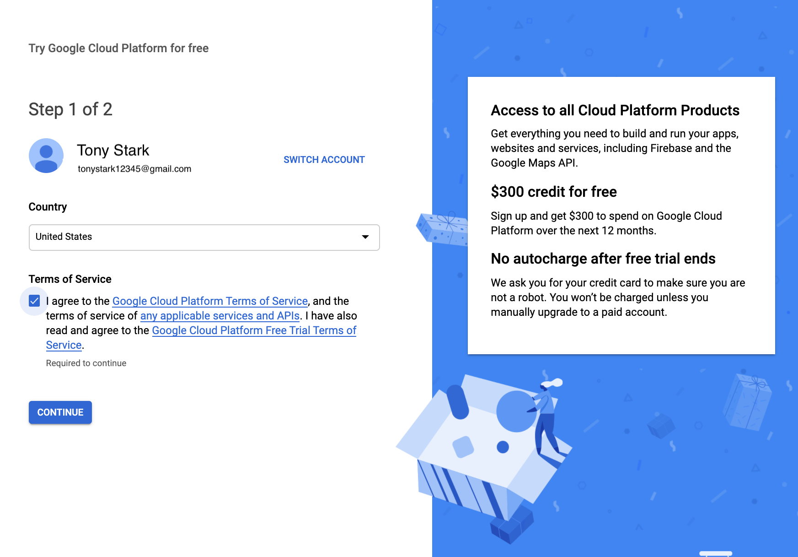

# Google Cloud Setup and Tutorial

Adopted from [CS231N's tutorial](https://github.com/cs231n/gcloud) and [CS294S/W's tutorial](https://github.com/stanford-oval/cs294-homework-workdir/blob/master/hw2/instructions/google-cloud.md).


# Table of contents

- [Google Cloud Setup and Tutorial](#google-cloud-setup-and-tutorial)
- [Table of contents](#table-of-contents)
  - [Overview](#overview)
    - [IMPORTANT: Make sure you stop your instances!](#important-make-sure-you-stop-your-instances)
  - [Create and Configure Your Account](#create-and-configure-your-account)
    - [Sign Up for GCP for the First Time](#sign-up-for-gcp-for-the-first-time)
    - [Configure Your Project](#configure-your-project)
  - [Claim GCP credits](#claim-gcp-credits)
  - [Request to Increase GPU Quotas](#request-to-increase-gpu-quotas)
    - [Why don't I See Any GPU-related Quotas](#why-dont-i-see-any-gpu-related-quotas)
  - [Set Up a Google Cloud Virtual Machine](#set-up-a-google-cloud-virtual-machine)
    - [Customize VM Hardware](#customize-vm-hardware)
  - [Access Your Newly Created VM](#access-your-newly-created-vm)
    - [Install gcloud command-line Tools](#install-gcloud-command-line-tools)
    - [Alternatives to the `gcloud` command](#alternatives-to-the-gcloud-command)
  - [Remote Server Development](#remote-server-development)
    - [Transferring Files From Your Instance To Your Computer](#transferring-files-from-your-instance-to-your-computer)
    - [Other Tips](#other-tips)
  - [IMPORTANT REMINDER: Make sure you stop your instances!](#important-reminder-make-sure-you-stop-your-instances)
    

## Overview 

For your homework and potentially your class project, we recommend setting up virtual machines on Google Cloud Platform (GCP).
This tutorial lists the necessary steps of working with Google Cloud. **We expect this tutorial to take up to an hour. Don't get intimidated by the steps, we tried to make the tutorial detailed so that you are less likely to get stuck on a particular step. Please ask your questions on Ed Discussion.**

### IMPORTANT: Make sure you stop your instances!

Do not forget to ***stop your instance*** when you are done (by clicking on the stop button at the top of the page showing your instances), otherwise you will ***run out of credits***. When you create a new VM, it will start by default, so you need to remember to turn it off.
You can always start your instance again and all your files will still be available.

## Create and Configure Your Account

**You should use your personal gmail account for GCP, i.e. NOT SUID@stanford.edu, because Stanford-managed email accounts do not support creating a new project or managing billing.** 

You should receive $300 credits from Google after you sign up with your personal gmail account and upgrade it into a full account as explained below. You can save this credit for later.
We offer GCP coupons for each student to use for the course.

### Sign Up for GCP for the First Time

1. Create a Google Cloud account by going to the [Google Cloud homepage](https://cloud.google.com "Title"). Click on the blue *Get Started for free* button. Sign into your Gmail account. Here is an example:

<center></center>

2. Choose *Account type* to be *Individual*. You will then fill in your name, address and credit card information. If you follow these instructions, your credit card will not be charged even if you run out of credit.

<center></center>

3. Click the *Google Cloud Platform* (in red circle), and it will take you to the main project dashboard:

<center></center>

### Configure Your Project 

1. On the main project dashboard, you can change the name of your project by clicking *Go to project settings*. 

<center></center>

2. To add project collaborators, click *Add people to this project*. Add their email address and choose their role to be *owner*. 

<center></center>

3. **Upgrade your account** in order to use GPUs following this [instruction](https://cloud.google.com/free/docs/gcp-free-tier#how-to-upgrade). Otherwise [Google Cloud Free Tier](https://cloud.google.com/free/docs/gcp-free-tier#how-to-upgrade) does not come with GPU support or quota.

<center></center>
<center></center>

## Claim GCP credits 

You should have created and logged into your GCP account registered with your personal gmail account by now. 

1. You should have received an email from the course staff with a link to the GCP coupon retrieval form. After your complete the form, you will see a link to Google Cloud Education Grants page. It requires your Stanford email to receive the credits. After you receive the coupon, you can (and should) use it with your personal gmail account.

<center></center>


1. After submission, you should receive a email from GCP with a link to confirm your email address. Click the link to verify your Stanford email.

<center></center>

1. You will soon receive another email from GCP with a link that applys the credits to your account. 

<center></center>

After that the website will jump to your [Billing](https://console.cloud.google.com/billing) page where you should see your have linked to *Building the Best Virtual Assistant* billing account with $50 credits. 

<center></center>

1. Switch billing accounts from Free Tier credits to *Building the Best Virtual Assistant* credits.
Google Cloud does not support combining credits. You will need to switch billing account if you want to use 2 sources of gcloud credits. 
i.e. if you want to use your $300 free credits after course credits are finished, you will need to then switch to the *Free Credit* billing account later. Refer to [Google Cloud documentation](https://cloud.google.com/billing/docs/how-to/modify-project#change_the_billing_account_for_a_project).

## Request to Increase GPU Quotas

Quota determines how many or how much of a particular resource (GPU, CPU cores, Disk space) you can create at a certain time.
Your account by default has a quota of 0 GPUs. You have to explicitly request Google Cloud to increase your quotas under *IAM & Admin > Quotas*. 

**Please request the quota increase ASAP**, because it might take some time to process. If you do not have GPU quota, you can get started by a CPU-only VM first and change the configuration later. The first half of the homework (synthesis) should be okay using a CPU-only VM.

Navigate to the *Quotas* page under *IAM & Admin*, add filter `GPUs (all regions)`, and select the service listed.
Select *Edit Quotas* and request an increase to 1 GPU (you will need 1 GPU at any given time).
If no such service can be found, see the [instruction below](#why-dont-i-see-any-gpu-related-quotas)

<center></center>

Wait until GCP send you a second email (first email is just to notify they receive the request). It will look like this. It could take couple minutes to couple days for them to approve your request.

<center></center>

### Why don't I See Any GPU-related Quotas

1. First, make sure you first upgrade your free tier account to full account following these [instructions](https://cloud.google.com/free/docs/gcp-free-tier#how-to-upgrade).

2. If you just registered for a Google Cloud account, GCP can be slow on setting up its Compute Engine API services (this is the service that provides GPU access, so the GPU quotas will not show up before it is ready). 
One way I found that can make Compute Engine API setup faster is by visiting the [VM instance page](https://console.cloud.google.com/compute/) by clicking  *Compute Engine > VM instances*.
If you see that Compute Engine is not ready yet, wait for couple of minutes until you see something like the screenshot below. The GPU-related Quotas should now show up in  *IAM Admin > Quotas*. 

<center></center>

3. For region-specific GPUs: Check that you have a default zone and region set under *Compute Engine > Settings > Region / Zone*. Some zones do not have certain GPU resources. Check [pricing and spec for GCP GPUs](https://cloud.google.com/compute/gpus-pricing) to find the availability of GPU resources. 

More instructions at [General quota instructions](https://cloud.google.com/compute/quotas#requesting_additional_quota) and [Step-by-step GPU-specific walk-through](https://stackoverflow.com/questions/45227064/how-to-request-gpu-quota-increase-in-google-cloud) (all answers in the link are useful)


## Set Up a Google Cloud Virtual Machine

### Customize VM Hardware 

We will use *Deep Learning VM* from GCP's marketplace. This will create a VM with CUDA and Pytorch installed and configured to work on GPUs. The operating system will be Debian 9. You should go through the following steps to create the instance. 

1. Go to [this Google Cloud Marketplace page](https://console.cloud.google.com/marketplace/config/click-to-deploy-images/tensorflow). You may be taken to a page where you have to click on *Launch*, and then you should see a configuration sheet titled *New Deep Learning VM deployment*.
1. Fill in `Deployment name` field with your preferred VM name.
2. In `Zone`, we recommend `europe-west4-*` because the GPU availability in US servers (e.g., `us-west1-b`, `us-central1-a`) has not been great when we test it. In practice, any server that provides V100/P100/A100 GPU would work, the only difference would be [latency](https://gcping.com/).
3. Under `Machine type`, choose `GPU` as the `Machine family`.
4. For `GPU type`, we recommend `NVIDIA Tesla V100`. It should cost around $2 per hour. P100 (cheaper and slight weaker) and A100 (more expensive, more powerful) also work. Check [pricing and spec for GCP GPUs](https://cloud.google.com/compute/gpus-pricing) for more details.
5. For `Machine type`, we recommend `n1-standard-8` which has 8 vCPUs and 30 GB memory.
6. In `Frameworks` field, change to `PyTorch 1.9 (CUDA 11.0)`.
7. Check the box `Install NVIDIA GPU driver automatically on first startup?`.
8. Leave all other options as default. You can change `Boot disk type` to `SSD Persistent Disk`, but this should not affect the performance.
9.  Click the blue botton `Deploy` at the end of the page. **This will automatically Start your Instance**, so if you do not need to use it now, **stop it immediately** after it is created.

Pay attention to the monthly price, make sure you claim only necessary HW resources, so that you can use your GCP instance for longer. 
**Once you run out of credits, the VM instance will be shut down automatically and you might lose unsaved data and models.** If you are almost running out of credits, contact the course staff.

After deploying a VM, you might encounter an **error message saying the zone does not have enough resources available to fulfill the request**. You can delete the deployment and go back to choose another zone or try again in a few minutes. If you could not to find any server with P100/V100/A100 that works, you can choose a weaker GPU option such as K80 to start and switch to a better one later at training step. You can also just use K80 to train the model, it's significantly cheaper, but it will take about 4 hours to train instead of 1 hour. 

You can always change number of CPUs, number of GPUs, CPU memory, and GPU type after your VM has been created.
Just stop your instance, go to your VM instance's details at *Compute Engine > VM instances* > [click on instance name]. 
Click *Edit* on your VM's page to modify the settings. Finally click *Save*.

Wait until the deployment is finished. You should see a running VM with a green checkmark next to it on your [Compute Engine page](https://console.cloud.google.com/compute/). Your instance will be started immediately after the deployment. **Stop the instance now**.

## Access Your Newly Created VM 

Now that you have created your virtual machine, you want to be able to connect to it from your computer. The rest of this tutorial goes over how to do that using a command-line tool. 

### Install gcloud command-line Tools
To access [gcloud commands](https://cloud.google.com/sdk/gcloud/reference) in your local terminal, install [Google Cloud SDK](https://cloud.google.com/sdk/docs) that is appropriate for your platform and follow their instructions. 

If `gcloud` command is not in your system path after installation, you can also reference it by its full path `/<path-to-directory-where-gcloud-is-installed>/bin/gcloud`.

To ssh into your VM, go to your VM instance details page by clicking on its name. Start the VM instance first. Once it has a green check mark on, click on the drop-down arrow and select `View gcloud command` instead to retrieve the terminal command. It should look like

```bash
gcloud compute --project "<YOUR_PROJECT_ID>" ssh --zone "<YOUR_ZONE>" "<YOUR_VM_NAME>"
```

<center></center>

See [this page](https://cloud.google.com/compute/docs/instances/connecting-to-instance "Title") for more detailed instructions.

### Alternatives to the `gcloud` command
1. You can use your favorite terminal to ssh to your VMs. See [thir-party tools documentation](https://cloud.google.com/compute/docs/instances/connecting-advanced#thirdpartytools) for details.

2. An easier alternative is to select *open in browser window*. However, you will not be able to transfer files or do port forwarding between your computer and your VM.


## Remote Server Development
### Transferring Files From Your Instance To Your Computer

For instance, to transfer `file.zip` from VM instance to your local laptop. There is an [easy command](https://cloud.google.com/sdk/gcloud/reference/compute/scp) for this purpose:

```
gcloud compute scp <user>@<instance-name>:/path/to/file.zip /local/path
```

For example, to download files from our instance to the current folder, run this command from your laptop:

```
gcloud compute scp tonystark@hw2-vm:/home/shared/file.zip .
```

The transfer works in both directions. To upload a file to your instance, run this command from your laptop:

```
gcloud compute scp /my/local/file tonystark@hw2-vm:/home/shared/
```

If you would like to transfer an entire folder, you will need to add a resursive flag: 
```
gcloud compute scp --recurse /my/local/folder tonystark@hw2-vm:/home/shared/
```

### Other Tips
If you have GPU enabled, you should be able to run `nvidia-smi` and see the list of attached GPUs and their usage statistics. Run `watch nvidia-smi` to monitor your GPU usage in real time.

You can use [Tmux](https://linuxize.com/post/getting-started-with-tmux/) to keep the training sessions running when you close your laptop. Also, if your collaborators log into the same account on the VM instance, they will see the same tmux session screen in real time. 

You can change your code on the remote server directly if you are comfortable with vim or emac, but note that this approach will use up your GCP credits very quickly.

You can develop locally on your favorite editor, push to your branch on Github, and pull on remote server to run.
(git commit frequently is also one of [good Github practices](https://www.datree.io/resources/github-best-practices))

Besides `gcloud compute scp`, another tool you can check out is [rsync](https://linuxize.com/post/how-to-use-rsync-for-local-and-remote-data-transfer-and-synchronization/) which can synchronize files and folders between your local machine and remote server.


## IMPORTANT REMINDER: Make sure you stop your instances! ##

Do not forget to stop your instance when you are done (by clicking on the stop button at the top of the page showing your instances).
You will be charged per hour when your instance is running. This includes code development time. We encourage you to read up on Google Cloud and regularly keep track of your credits.
